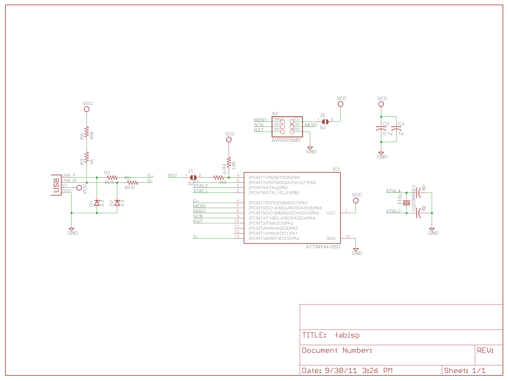
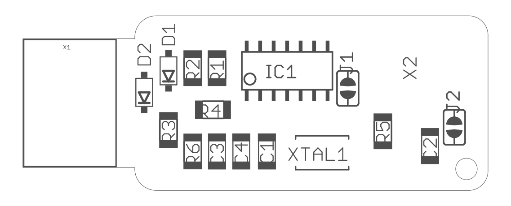
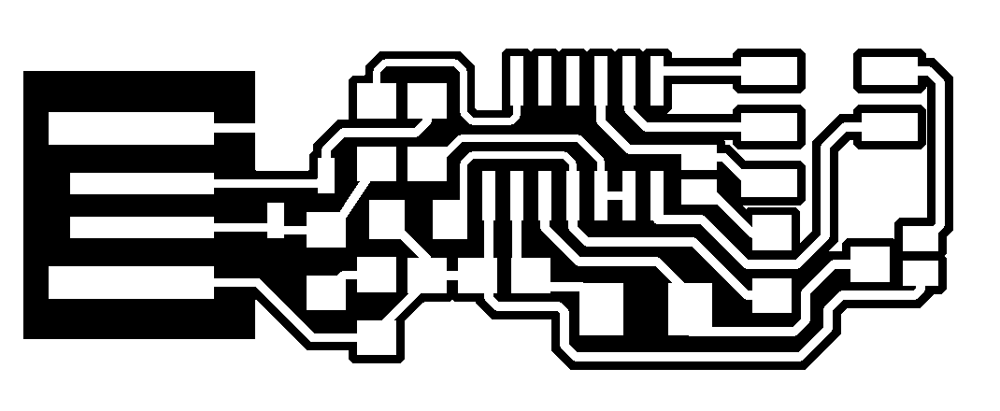
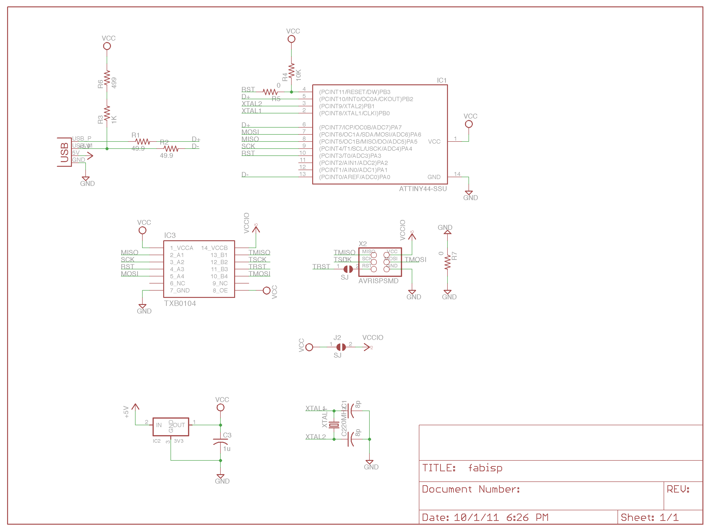
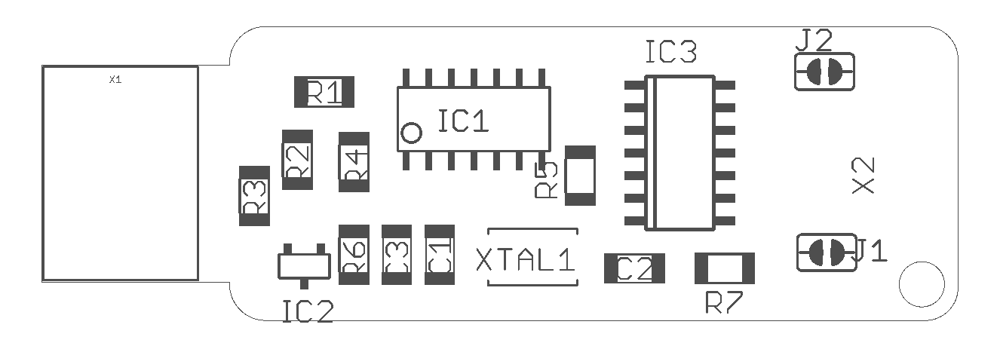
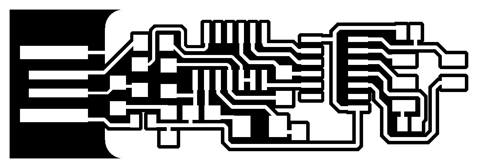

# FabISP

_FabISPkey V1.0 (current revision is V2.3, after V2.2, V2.1, V2.0 and V1.1)_

The geneology of the FabISP design is interesting in its own right; Neil's [FabISP](http://academy.cba.mit.edu/classes/electronics_production/index.html) is based on David Mellis's [FabISP](http://fab.cba.mit.edu/content/projects/fabisp/) which is based on Limor's [USBTinyISP](http://www.ladyada.net/make/usbtinyisp/index.html) which is based on Dick Streefland's [USBTiny](http://dicks.home.xs4all.nl/avr/usbtiny/).

## FabISPkey

### Design

I decided I could make a few tweaks to the design, electrically and mechanically. First, I tried out my mechanical modifications before I dove too deeply into electrical modification. Next, I redrew David's schematic in EagleCAD. I replaced the USB connector with a board edge USB connector from the SparkFun library. I also replaced the crystal with one that I had on hand, which ended up being a mistake, and in later designs I used the one in the Fab inventory, which is smaller. All the parts can be found in the standard fab inventory.

<table align="center">
<tbody>
<tr>
<td></td>
<td></td>
</tr>
</tbody>
</table>

_Version 2.3 FabISPkey, schematic and assembly drawing_

In general, I made the total footprint a little smaller and replaced the mini-USB connector with a board connector. In a second design, I added a level shifter to accommodate programming of low voltage (1.8V) targets.

Some notes: I use a ground pour, because I figure if I'm going to have extra copper on my board, I'd like to know what it's connected to. The pour has 0.020 spacing, so slightly more than one pass with a 0.015 endmill cuts it out. 

### Fabrication

Because the connector, the design requires complete copper removal (-1 contours flag). Also, the board connector is a little wiggily, so, it's sometimes helpful to glue or tape a small (0.010") shim on the underside of the connector. I use a piece of an old credit card and the same double sided tape used to affix the boards to the Modella.

When populating the board, be sure to observe polarity on for the zeners and the ATtiny. I did not leave thermal reliefs on the ground pour (I find they don't come out well on the Modella, also decreases cut time). Because there are no thermals, be sure to avoid cold solder joints on all components connected to the ground plane. 

<table align="center">
<tbody>
<tr>
<td></td>
<td></td>
</tr>
</tbody>
</table>

_Version 2.3 FabISPkey_

If you'd like to play along at home, you can grab fabbable PNGs above and you can get the design files in this content directory.

### Programming

Since my design is electrically similar to Neil and David's, programming is very similar. 

1.  Solder the reset jumper (the one closest to the processor)
2.  Power the board (using a USB port, or USB charger)
3.  Using a standard programming cable, connect your programmer to be to another programmer (connect Pin 1 to Pin 1, Pin 2 to 2 and so on)
<li>Program it with another programmer (make hex, make fuse, make program)
4.  Unplug the programming cable, remove power, and desolder the jumper
5.  Spawn more programmers!

## FabISPlokey

One of the main motivations of the board re-design was to incorporate a level shifter to allow the programming of 1.8V targets. This is a particularly important feature (especially for this class) because it allows the use of a single cell to power designs.

The Lokey dispenses with the 3.3V zeners and adds a 3.3V regulator (in the Fab inventory). The microcontroller now runs on 3.3V, no need for the zeners to make it USB compliant. 

Having a 3.3V Vcc is required to use the level shifter I selected, the Texas Instruments [TXB0104](http://www.ti.com/lit/ds/symlink/txb0104.pdf). The TX0104 is available in a 14 SOIC package (which is easily fabricatable on the Modella), and if you ask nicely, TI will happily sample a few parts to you. 

<table align="center">
<tbody>
<tr>
<td></td>
<td></td>
</tr>
</tbody>
</table>

_Version 2.3 FabISPkey, schematic and assembly drawing_

<table align="center"><tbody>
<tr><td></td>
<td></td>
</tr>
</tbody>
</table>

_Version 2.1 FabISPlokey_

I do not have any 1.8V targets to try this design on and should be considered an untested reference design (though it should work), Nevertheless, if you'd like to try it out yourself, you can grab the PNGs above or from the repo (it's in the same project as the Key).

_Created by [Andy Bardagjy](http://bardagjy.com) 12/19/2011, modified 1/7/2015_
